# AI-Assisted Retail Performance Analysis
## 1. Project Overview
The project examines how AI can be used as an analytics tool across an end-to-end retail performance analysis workflow.

AI was used to explore the data, assess data quality, propose analytical questions, perform calculations, create visualizations, and interpret results. I guided the process by investigating questionable records, refining prompts, evaluating AI suggestions, changing the analytical direction when needed, and deciding which findings required further investigation.

Python was used independently after the AI-assisted analysis to reproduce key calculations and validate the main results.

The workflow separated three roles:

- **AI:** data exploration, analysis, visualization, and interpretation
- **Analyst:** questioning, review, analytical decisions, and investigation direction
- **Python:** independent validation of AI-generated results

## 2. Dataset

The analysis uses the [Online Retail Dataset](https://www.kaggle.com/datasets/adsamardeep/retail-sales), containing transaction-level data from an online retailer across 2009–2011.

Two yearly datasets were used and later combined for the analysis.

| Variable | Description |
|---|---|
| Invoice | Invoice or transaction identifier |
| StockCode | Product identifier |
| Description | Product description |
| Quantity | Number of units in the transaction line |
| InvoiceDate | Transaction date and time |
| Price | Unit price |
| Customer ID | Customer identifier |
| Country | Customer/transaction country |

Each row represents one product line within an invoice. One invoice can therefore contain multiple rows.

## 3. Data Exploration and Quality Assessment

Before defining the analytical question, I guided AI through a step-by-step exploration of both yearly datasets.

The process started with reviewing all variables and sample records. I then asked AI to inspect additional random records to confirm the format and meaning of each variable before conducting data quality checks.

The checks covered:

- missing and empty values;
- data types and unexpected formats;
- exact duplicate rows;
- negative and zero values;
- numerical ranges and extreme values; and
- unusual transaction and product descriptions.

Descriptive statistics were also examined to identify records requiring transaction-level investigation.

### 3.1 Negative and Zero Prices

Negative prices were investigated before defining a cleaning rule.

In the "Retail 2010-11" dataset, AI identified two negative-price records. Both had a unit price of **−11,062.06** and the description **Adjust bad debt**. I asked AI to retrieve the underlying records and explain their likely meaning. The records represented accounting adjustments outside the scope of the retail sales analysis.

Zero-price records also did not contribute sales revenue and included stock-related or other non-standard transactions. Transactions with **Price <= 0** were therefore excluded from the sales analysis.

### 3.2 Negative Quantities

Negative quantities with positive prices were retained.

Transaction-level inspection showed that negative quantities could contain meaningful cancellation or reversal information. Extreme positive and negative quantities also appeared in matched transactions, including **+80,995 and −80,995 units**. Removing all negative quantities would  remove information required for the return/cancellation analysis.

### 3.3 Duplicate Records

Duplicates were checked across all columns.

The 2010–11 dataset contained **5,268 additional exact duplicate rows**, approximately **0.97%** of the dataset. I asked AI to inspect duplicate examples and consider whether repeated product lines could represent legitimate transactions. Only additional rows matching across all fields were treated as duplicates and removed.

### 3.4 Extreme Values

Extreme Quantity and Price values were investigated instead of being removed automatically with statistical outlier rules. Large quantities could represent bulk orders, cancellations, or transaction reversals. High prices could also correspond to fees or special transactions. Cleaning decisions were therefore based on transaction meaning and business rules.

### 3.5 Final Cleaning Rules

| Data issue | Decision |
|---|---|
| Exact duplicate rows | Remove additional exact copies |
| Price < 0 | Remove from retail sales analysis |
| Price = 0 | Remove from retail sales analysis |
| Quantity < 0 and Price > 0 | Retain for return/cancellation analysis |
| Extreme Quantity values | Retain unless transaction investigation indicates an error |
| Missing Customer ID | Retain for sales analysis |
| Accounting adjustments such as `Adjust bad debt` | Exclude from retail sales analysis |

The two yearly datasets were cleaned separately, combined, and checked again for duplicate records.

## 4. Analytical Question Setup

After AI had developed an understanding of the cleaned dataset, I asked it to propose **10 analytical questions** that could be investigated with the available data.

I then asked AI to examine the top three questions by identifying:

- the exact variables required for each analysis; and
- whether the available data was sufficient to answer each question.

The variable check exposed limitations in some proposed analyses.

Customer-focused analysis, for example, relied mainly on Customer ID and transaction history. Customer ID also contained substantial missing data, and no demographic or customer profile attributes were available for profile-based segmentation.

Sales performance analysis was directly supported by Quantity, Price, InvoiceDate, Country, StockCode, and Description.

Finally, the analytical objective was defined as:

> **Examine how sales performance changed over time and identify the countries and products driving major sales and return/cancellation events.**

The investigation focused on three questions:

- How did gross sales, returns/cancellations, and net sales change over time?
- Which countries and products contributed to the largest positive net-sales events?
- What drove the largest return/cancellation events?

## 5. Sales Performance Analysis

### 5.1 Daily Sales Trend

Revenue was calculated at transaction-line level:

**Revenue = Quantity × Price**

Three measures were defined:

- **Gross sales:** revenue from transactions with Quantity > 0
- **Returns/cancellations:** revenue from transactions with Quantity < 0
- **Net sales:** gross sales combined with returns/cancellations

Negative quantities are described as **returns/cancellations** because the available variables do not establish the reason for every negative transaction.

AI aggregated the data by date and plotted the three measures across the full 2009–2011 period.

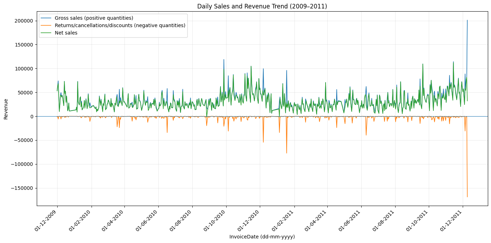

Daily performance varied substantially, with both positive sales spikes and large negative events.

Sales activity increased noticeably during the later months of both available annual cycles, particularly around autumn and the pre-Christmas period. The dataset covers approximately two annual cycles, so the pattern is treated as **consistent with seasonality**, not as evidence of a stable long-term seasonal pattern.

### 5.2 Net-Sales Spike Analysis

The first spike investigation considered gross sales.

Reviewing the daily trend showed a problem with using gross sales alone: some dates with high positive sales also contained substantial negative transactions.

I therefore redirected the analysis toward **net sales** to identify the strongest daily sales events after accounting for negative transactions.

AI ranked the **Top 20 daily net-sales dates** and decomposed each date by country.

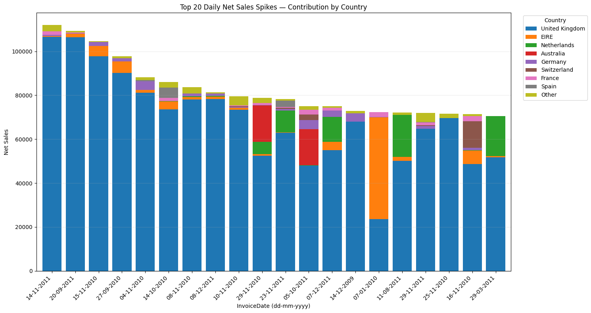

The largest net-sales dates were mostly driven by the UK, which also accounted for the majority of transaction activity in the dataset.

Several dates showed a different pattern:

- **07-01-2010** was dominated by **EIRE (Ireland)**.
- **29-11-2010** included a substantial contribution from **Australia**.
- **11-08-2011** included a large contribution from the **Netherlands**.
- **29-03-2011** also showed a substantial **Netherlands** contribution.
- **16-11-2010** contained a noticeable contribution from **Switzerland**.

The country decomposition showed that an overall ranking dominated by the UK could hide important international sales events.

### 5.3 Product Drivers of Net-Sales Spikes

Product contributions were then examined separately for UK and non-UK transactions.

For the UK, the analysis ranked the leading product contributors across the Top 20 spike dates and grouped the remaining products as **Other products**.

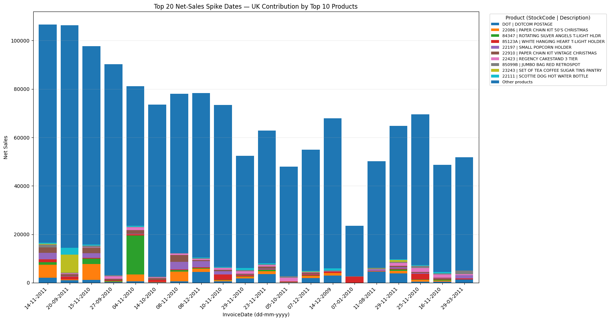

The UK spikes were not generally explained by a single recurring product. Most daily revenue remained distributed across **Other products**, indicating a broad product mix behind many of the strongest UK sales days.

Several products nevertheless made visible contributions on individual dates, including:

- `22086 — PAPER CHAIN KIT 50'S CHRISTMAS`
- `84347 — ROTATING SILVER ANGELS T-LIGHT HLDR`
- `85123A — WHITE HANGING HEART T-LIGHT HOLDER`
- `22197 — SMALL POPCORN HOLDER`
- `22423 — REGENCY CAKESTAND 3 TIER`

The analysis also identified `DOT — DOTCOM POSTAGE` among the leading StockCodes. Product descriptions were therefore required alongside StockCode to distinguish merchandise from postage and other operational transactions.

For non-UK transactions, the leading products included:

- `23084 — RABBIT NIGHT LIGHT`
- `POST — POSTAGE`
- `22423 — REGENCY CAKESTAND 3 TIER`
- `22629 — SPACEBOY LUNCH BOX`
- `22326 — ROUND SNACK BOXES SET OF4 WOODLAND`

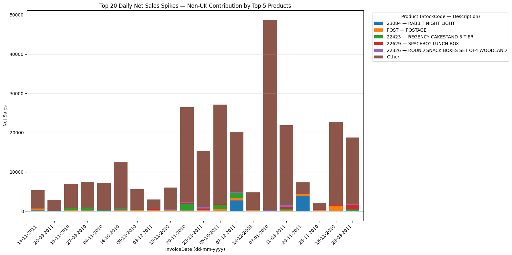

The large **Other** category again showed that many international spike dates were not generated by only one of the five leading products.

### 5.4 International Market Drill-Down

The country decomposition identified several non-UK dates worth investigating in more detail.

I selected **Australia, EIRE, and the Netherlands** and asked AI to decompose their major spike dates by product.

#### 5.4.1 Australia

Two Australian dates were investigated:

- 29-11-2010
- 05-10-2011

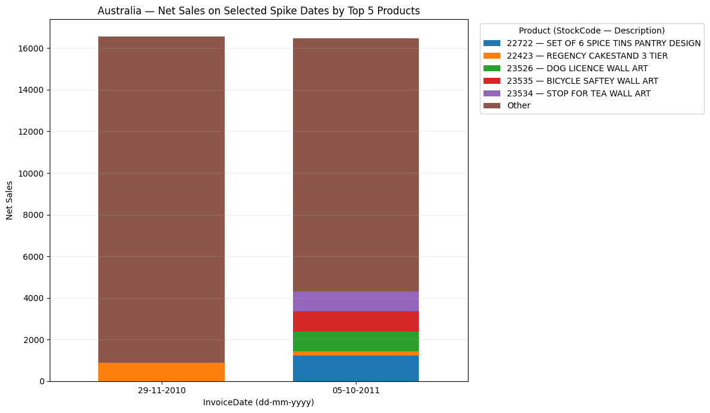

The product mix differed between the two dates.

On **29-11-2010**, `22423 — REGENCY CAKESTAND 3 TIER` was the only one of the overall Top 5 products making a visible major contribution, while most net sales came from products grouped as **Other**.

On **05-10-2011**, the selected Top 5 products contributed more visibly. They included:

- `22722 — SET OF 6 SPICE TINS PANTRY DESIGN`
- `22423 — REGENCY CAKESTAND 3 TIER`
- `23526 — DOG LICENCE WALL ART`
- `23535 — BICYCLE SAFETY WALL ART`
- `23534 — STOP FOR TEA WALL ART`

Most revenue on the date still came from the broader product mix.

#### 5.4.2 EIRE

The EIRE spike on **07-01-2010** was examined separately.

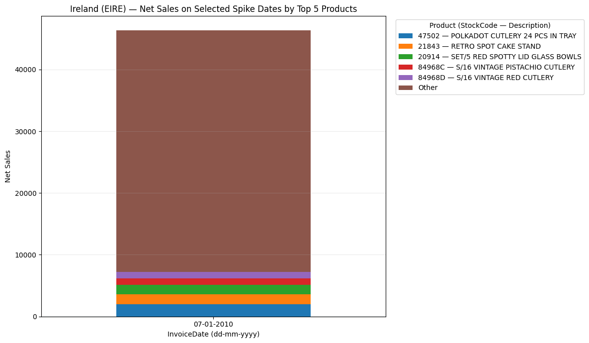

The Top 5 products were:

- `47502 — POLKADOT CUTLERY 24 PCS IN TRAY`
- `21843 — RETRO SPOT CAKE STAND`
- `20914 — SET/5 RED SPOTTY LID GLASS BOWLS`
- `84968C — S/16 VINTAGE PISTACHIO CUTLERY`
- `84968D — S/16 VINTAGE RED CUTLERY`

The five products explained only a limited share of the total spike. Most net sales came from **Other** products, indicating that the event was spread across a wider product mix.

#### 5.4.5 Netherlands

Five Dutch spike dates were investigated:

- 29-11-2010
- 23-11-2010
- 07-12-2011
- 11-08-2011
- 29-03-2011

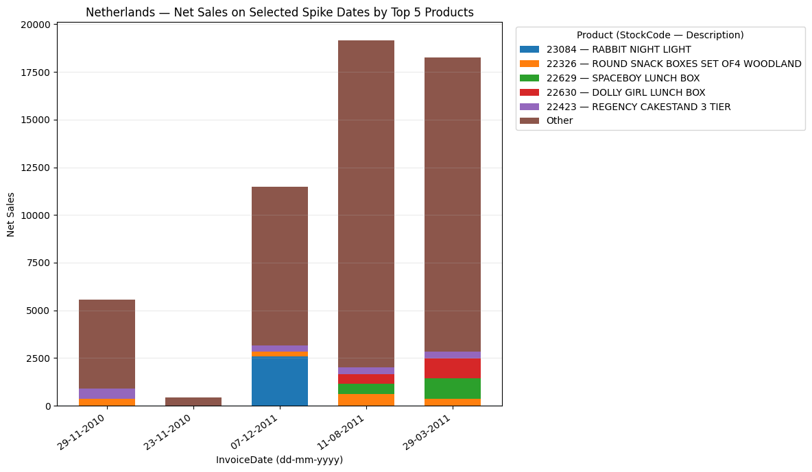

The leading products included:

- `23084 — RABBIT NIGHT LIGHT`
- `22326 — ROUND SNACK BOXES SET OF4 WOODLAND`
- `22629 — SPACEBOY LUNCH BOX`
- `22630 — DOLLY GIRL LUNCH BOX`
- `22423 — REGENCY CAKESTAND 3 TIER`

`RABBIT NIGHT LIGHT` made a particularly visible contribution on **07-12-2011**, while `REGENCY CAKESTAND 3 TIER` appeared across several selected Dutch dates.

The majority of revenue on the largest Dutch spike dates still came from **Other** products.

### 5.5 Return and Cancellation Spikes

Positive sales spikes explained only one side of performance variation.

AI next ranked the **Top 10 return/cancellation dates** and separated UK and non-UK contributions.

#### 5.5.1 UK

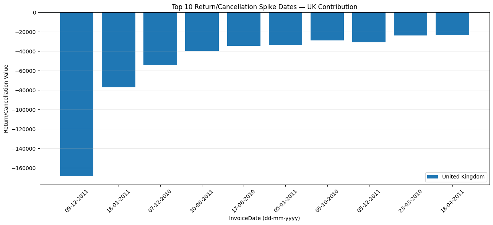

The largest UK negative event occurred on **09-12-2011**, with a return/cancellation value of roughly **−170,000** based on the daily aggregation.

The next step decomposed the same dates by product.

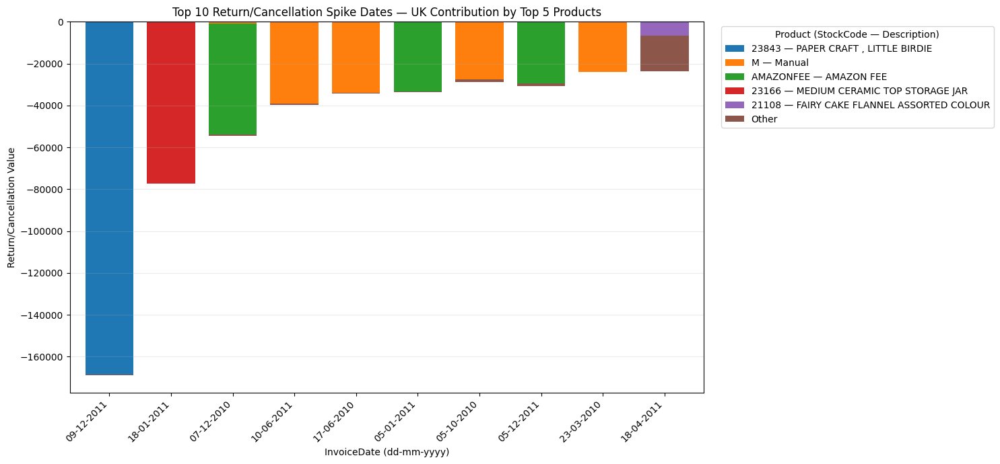

The largest event was overwhelmingly associated with:

`23843 — PAPER CRAFT, LITTLE BIRDIE`

Other major negative dates were associated with different products or transaction types:

- `23166 — MEDIUM CERAMIC TOP STORAGE JAR`
- `AMAZONFEE — AMAZON FEE`
- `M — Manual`
- `21108 — FAIRY CAKE FLANNEL ASSORTED COLOUR`

The result is important because the largest negative events did not all represent the same type of business issue. The presence of **AMAZON FEE** and **Manual** transactions shows that operational transactions also contributed to the negative-revenue series.

#### 5.5.2 Non-UK

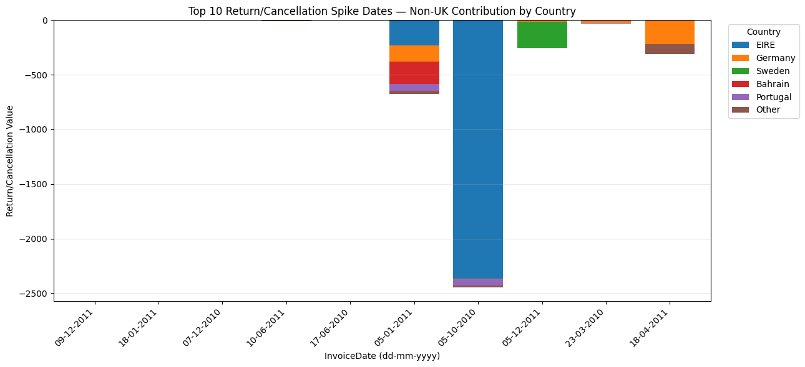

Non-UK return/cancellation values were much smaller than the largest UK events.

The largest non-UK spike occurred on **05-10-2010** and was driven mainly by **EIRE**, at approximately **−2,400**.

Other visible country contributions included Sweden, Bahrain, Portugal, and Germany on different dates.

Product decomposition showed that the largest non-UK negative event was primarily associated with: `M — Manual`

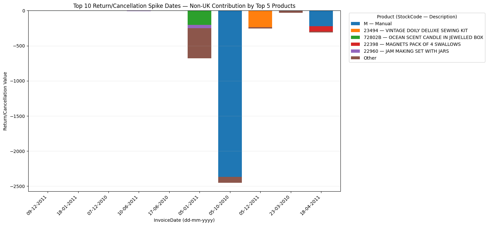

Other identified contributors included:

- `23494 — VINTAGE DOILY DELUXE SEWING KIT`
- `72802B — OCEAN SCENT CANDLE IN JEWELLED BOX`
- `22398 — MAGNETS PACK OF 4 SWALLOWS`
- `22960 — JAM MAKING SET WITH JARS`

The difference between UK and non-UK return/cancellation magnitudes also reinforced the importance of analyzing the two groups separately.

## 6. Key Findings

### 6.1 Net sales was more informative than gross sales for identifying strong sales days

Some high gross-sales dates also contained large negative transactions. Ranking daily performance by net sales prevented those negative transactions from being ignored when identifying major positive events.

### 6.2 Overall sales spikes were mainly UK-driven, but several international events were substantial

Most Top 20 net-sales dates were dominated by the UK.

Separate country analysis exposed major contributions from EIRE, the Netherlands, Australia, and Switzerland on specific dates that would have been less visible in an overall UK-dominated analysis.

### 6.3 Large sales days were usually supported by a broad product mix

The **Other products** category represented most revenue on many UK and international spike dates.

Major daily sales events therefore could not generally be attributed to one recurring best-selling product.

### 6.4 Individual products still explained specific international patterns

`RABBIT NIGHT LIGHT` made a visible contribution to the Netherlands spike on 07-12-2011, while `REGENCY CAKESTAND 3 TIER` appeared among the leading products in multiple international analyses.

Australia showed a different product mix across its two selected spike dates.

### 6.5 The largest negative event was highly concentrated

The UK return/cancellation spike on 09-12-2011 was dominated by `PAPER CRAFT, LITTLE BIRDIE`.

The concentration differed sharply from many positive sales spikes, where revenue was distributed across a wider product mix.

### 6.6 Negative revenue included operational transactions as well as merchandise

`AMAZON FEE` and `Manual` appeared among the leading contributors to major negative events.

Return/cancellation analysis therefore requires transaction-level interpretation and cannot automatically treat every negative quantity as a customer product return.

### 6.7 Statistical outliers could represent meaningful business events

Matched positive and negative transactions showed that extreme quantities could represent sales followed by cancellations or reversals.

Automatically deleting extreme observations would have removed information relevant to the analysis.

## 7. AI Interaction and Analytical Decisions

AI outputs were treated as analytical inputs that required review and follow-up.

| Stage | AI finding or initial output | My follow-up and decision |
|---|---|---|
| Dataset understanding | AI identified the eight variables and their initial formats. | I requested additional random records before continuing to confirm the meaning of IDs, dates, products, and transaction lines. |
| Negative prices | AI detected two negative-price records. | I asked AI to retrieve and interpret the records. Both were `Adjust bad debt` entries at −11,062.06 and were excluded as accounting adjustments outside the scope of retail sales analysis. |
| Zero prices | AI identified zero-price transactions. | I investigated their descriptions with AI. The records included stock-related and other non-revenue transactions, so Price = 0 was excluded. |
| Negative quantities | AI flagged negative Quantity values as unusual. | I investigated examples before cleaning. Matched positive and negative transactions showed that negative quantities could contain cancellation or reversal information, so Quantity < 0 with Price > 0 was retained. |
| Extreme values | AI identified very large Quantity and Price values. | I did not apply automatic statistical outlier deletion. Transaction meaning was investigated because bulk orders, reversals, fees, and adjustments could produce legitimate extreme values. |
| Duplicate records | AI identified exact duplicate rows. | I asked AI to examine examples and consider whether repeated product lines could be legitimate. Only additional rows identical across all fields were removed. |
| Analytical questions | AI proposed 10 possible analytical questions. | I asked AI to identify the exact variables required for the top three and assess whether the available data could support them before defining the analytical objective. |
| Sales spikes | AI initially analyzed gross sales, returns/cancellations, and net sales together. | I changed the spike investigation to net sales after observing that high gross sales could coincide with substantial negative transactions. |
| Country analysis | UK dominated the overall results. | I separated UK and non-UK analyses and drilled into Australia, EIRE, and the Netherlands. |
| Product analysis | AI ranked products using StockCode. | I added Description to the analysis so that the business meaning of each StockCode could be evaluated. The check exposed postage and operational codes among the ranked items. |
| Negative spikes | AI identified the largest return/cancellation dates. | I decomposed the dates by country and product to distinguish product-related events from operational transactions such as `Manual` and `AMAZON FEE`. |

## 8. Python Validation

Python was used independently after the AI-assisted workflow to validate the calculations and analytical results.

The validation reproduced the analysis directly from the cleaned transaction data.

Checks included:

- duplicate removal;
- Price filtering;
- revenue calculation;
- gross sales;
- returns/cancellations;
- net sales;
- daily aggregation;
- Top 20 net-sales dates;
- country contributions;
- UK and non-UK product contributions;
- selected international market drill-downs;
- Top 10 return/cancellation dates; and
- product decomposition of major negative events.

The independently calculated outputs were compared with the AI-generated results to verify that the same major dates, countries, products, and patterns could be reproduced.

## 9. Limitations

**Transaction meaning.** Negative quantities can represent returns, cancellations, reversals, or other negative transactions. No dedicated variable explains the reason for every negative transaction.

**Customer analysis.** Customer ID contains substantial missing data, and no demographic or profile variables are available.

**Seasonality.** The dataset covers approximately two annual cycles. A longer time series would be required to establish a stable seasonal pattern.

**Market size.** UK transactions dominate the dataset. Absolute country contributions therefore reflect both market size and daily performance.

**Product concentration.** Product decomposition identifies which products contributed to a spike but does not establish whether the event came from many customers or a small number of large orders.

## 10. Potential Next Steps

A further analysis could determine whether major net-sales spikes reflected broad customer demand or concentrated large orders.

Useful measures would include:

- number of invoices;
- number of customers;
- units sold;
- average order value; and
- largest invoice share of daily net sales.

Monthly net sales and year-over-year monthly changes could also provide a stronger test of the seasonal pattern observed in the daily series.
